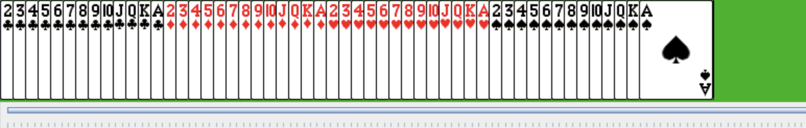

# Card Sorting 

> An animated card sorter that uses the Insertion Sort, Selection Sort, Merge Sort, and Quicksort algorithms on Linked Lists and compares their running times.

<a name="toc"/></a>
## Table of Contents

1. [Overview](#overview)

2. [Technologies](#technologies)

3. [Launch](#launch)

4. [Sample Output](#output)

5. [Source](#source)

<a name="overview"/></a>
## 1. Overview
[Back to ToC](#toc)

Summaries of the sorting algorithms:

* SelectionSort

    + Until unsorted is empty:
        - Scan unsorted for the smallest remaining element.
        - Remove that element from unsorted and add it to the tail of sorted.

* InsertionSort

    + Until unsorted is empty:
        - Remove the first element from unsorted and find the point where it should go in sorted (the point where all previous elements are smaller than the removed element, and all following elements are greater than or equal to it).
        - Insert the removed element into sorted at this point.

* MergeSort

    + Begin by placing each element of unsorted into its own new singleton CardPile, and add all those piles to a queue.
    + While more than one list remains on the queue:
        - Remove the first two lists from the queue and merge them, preserving their sorted order.
        - Put the result back at the end of the queue.

    + To merge two sorted lists into a single sorted list:

        - Look at the first element in each list.
        - Take the smaller of the two off the front of its old list and put it at the end of a new (merged) list.
        - Repeat this until both one of the old lists is empty, at which point append the remainder of the other original list to the new list.
        - If the original lists were sorted, and if the smallest element available is always taken, then the resulting list will also be sorted.


* Quicksort

    + Like MergeSort, it's a recursive algorithm: the stop condition is a list with 0 or 1 elements, which is already sorted and can simply be returned.
    + For the recursive step, do the following:

        - Take the first element as the pivot.
        - Pull the remaining elements off the list one at a time and append them to either of two new sublists: one for elements less than the pivot and one for elements greater than or equal to the pivot.
        - Recursively sort the two sublists, then glue the results back together with the pivot in the middle, and return that as the result.

<a name="technologies"/></a>
## 2. Technologies
[Back to ToC](#toc)

java version "1.8.0_181"<br />
Java(TM) SE Runtime Environment (build 1.8.0_181-b13)<br />
Java HotSpot(TM) 64-Bit Server VM (build 25.181-b13, mixed mode)<br />

<a name="launch"/></a>
## 3. Launch
[Back to ToC](#toc)
```bash
javac -classpath .:target/dependency/* -d . $(find . -type f -name '*.java')

java -classpath .:/run_dir/junit-4.12.jar:target/dependency/* Main
```
<a name="technologies"/></a>
## 4. Sample Output
[Back to ToC](#toc)

<p align="center">

</p>

## 5. Source
[Back to ToC](#toc)

This project uses classes developed by Professor Nick Howe to implement a graphical user interface for tracking and displaying sorting activities.